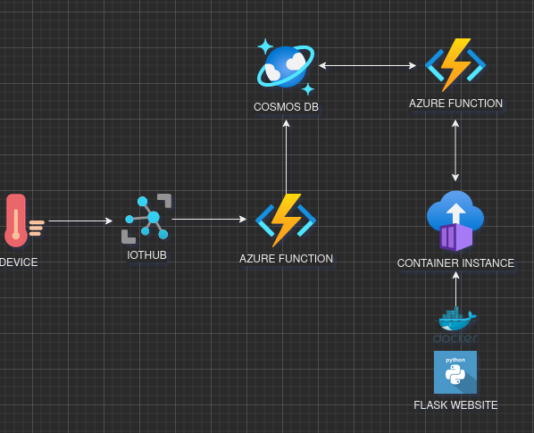
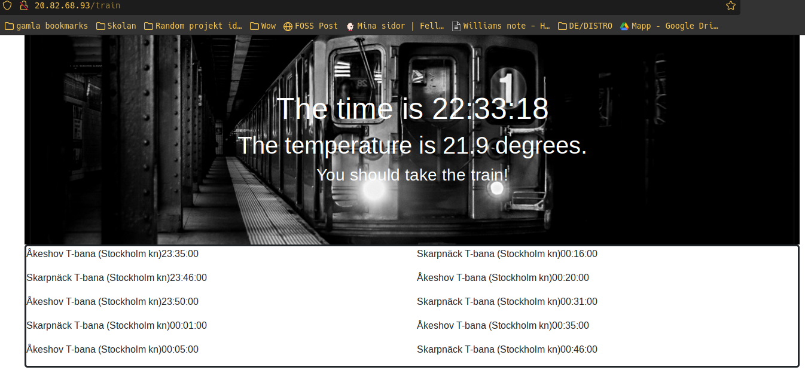

# Projekt Arbete IoT och Molntjänster

## Summary

The idea of this project is to build an application which will tell me if I can take the bike to school/work or if it's better to use the subway. It will do this by collecting temperature data from a sensor and determine wether it's too cold to bike, if it is the application will recommend subway departures for me. This is to relieve me of some stress in the morning. 

This project was a lot of fun since I got to play with both Flask and Docker which I've never tried before and even though the project seems a bit simple it was good practice for me to try alot of new technologies/frameworks!

This is a sketch of the system design:

## Device

In this project I've used a simulated device to be able to produce different types of temperature data. The reason I didn't build a device with a temperature sensor is because it's winter time and I wanted to test my project with various temperatures. I built the simulated device in python and sent the values to Azure IoT-Hub.

## Storage

I chose to store the messages from the device in a CosmosDB. CosmosDB works great to store simple telemetry messages from a device in cases that doesn't require a relational database. It's also easy to integrate with IoT Hub and Azure Functions. I chose to use the standard API which is a uses SQL-like queries to get data from the database, because of the easy syntax and good documentation.

## Azure Functions

I have two functions inside one function app. The first one triggers on a every new message in the IoT Hub and forwards the message to CosmosDB. The second one triggers on a HTTP request from the website and sends the contents of the cosmosDB as a response.
I chose to write the Azure functions i C# and develop and testing them locally before pushing them to Azure. I thought about developing them in a different language like Python but in the end I found it more convenient to make them in C#.

## Website/Docker

This part of the project was probably the most interesting one for me since I've never really built websites before. I chose to do this with Flask in Python, as you can tell I'm not really a front end developer (yet), but I had a lot of fun. One of the more challenging parts was to figure out a way to manage secrets (API keys etc.) when uploading it to a cloud service. I tested both Azure Key Vault and simple .env files and I got it to work in the end. I chose to deploy the website to Azure in a docker container since I've never tried that before. I published my docker image to dockerhub and hosted it on Azure via Azure Container Instance. I didn't get it to work with Azure App Services which was my first choice but I'll probably figure it out in the future.

This is how the website turned out:

## API

Because of restrictions of certain API:s I chose to call the API:s from the backend of the website, instead of from a Azure Function. This is because some of the API:s didn't allow any retention of data, and I didn't want to risk anything by saving the data in the database. I could have used an azure function to call the with either a timing trigger or HTTP Request trigger, but that would only mean an extra step instead of just calling it directly from the website backend. The API that I used is [ResRobot](https://www.trafiklab.se/api/trafiklab-apis/resrobot-v2/timetables/) and I got the API key from [Trafiklab](https://www.trafiklab.se). 

## Future

In the future I would like to try to integrate some kind of integration with my cell phone either in the form of an app that can send notifications or maybe an sms service. 

I would also like to make the application more open for other people to use. This could done by making a setup page where you can choose the closes subway stop to you etc. You could also include more API:s like a weather API to make more accurate weather predictions. 

Last but not least it would be interesting to train a machine learning model to make the decision depending on the weather instead of harcoding a temperature value. I could make the model take in more data such as rain/snow the weather forecast for the whole day etc. Afterall the temperature is not the only deciding factor to if you should bike or take the train.

## Credits
Special thanks to Microsofts documentation of Azure, StackOverflow and my dog! 